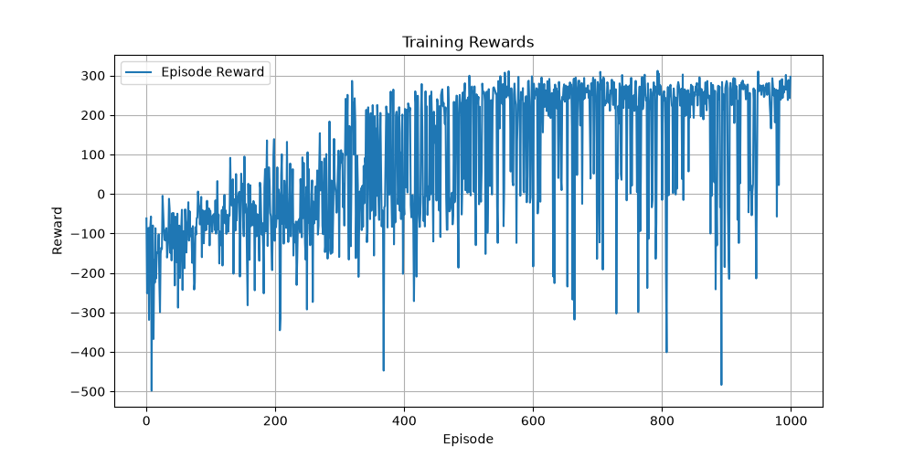

# 🚀 LunarLander-DQN

## 👨‍💻 Author

**Abhishek Thakur**

**GitHub:** https://github.com/Abthakur-hub

---

A Deep Q-Network (DQN) implementation using **PyTorch** to solve the **LunarLander-v3** environment from Gymnasium. This project demonstrates how a reinforcement learning agent learns to safely land a spacecraft using Deep Q-Learning, Experience Replay, and Target Networks.

---

## 📌 Overview

The objective of the LunarLander environment is to train an agent to land a spacecraft safely between the landing flags while minimizing fuel usage and avoiding crashes.

This project implements the **Deep Q-Network (DQN)** algorithm completely in PyTorch and includes all the essential components required for stable reinforcement learning.

---

## ✨ Features

* 🚀 Deep Q-Network (DQN)
* 🎯 Epsilon-Greedy Exploration
* 🧠 Experience Replay Buffer
* 🔄 Target Network
* 💾 Automatic Best Model Saving
* 📊 Reward Curve Visualization
* 🎥 Gameplay Recording
* 🧪 Multi-Episode Evaluation
* 📦 Modular Project Structure
* ⚡ PyTorch Implementation

---

## 🛠️ Tech Stack

* Python 3.11
* PyTorch
* Gymnasium
* NumPy
* Matplotlib
* MoviePy
* ImageIO
* tqdm

---

## 📂 Project Structure

```text
LunarLander-DQN/
│
├── checkpoints/
│   └── best_model.pth
│
├── models/
│   ├── agent.py
│   └── dqn.py
│
├── utils/
│   ├── replay_buffer.py
│   └── plot.py
│
├── videos/
│
├── config.py
├── train.py
├── test.py
├── record.py
├── reward_plot.png
├── requirements.txt
├── README.md
└── .gitignore
```

---

## ⚙️ Installation

### Clone the repository

```bash
git clone https://github.com/Abthakur-hub/LunarLander-DQN.git
cd LunarLander-DQN
```

### Create a virtual environment

#### macOS / Linux

```bash
python3.11 -m venv venv
source venv/bin/activate
```

#### Windows

```bash
python -m venv venv
venv\Scripts\activate
```

### Install dependencies

```bash
pip install -r requirements.txt
```

---

## ▶️ Training

Train the DQN agent:

```bash
python train.py
```

The best-performing model will automatically be saved in:

```text
checkpoints/best_model.pth
```

---

## 🧪 Testing

Evaluate the trained model across multiple episodes:

```bash
python test.py
```

This script reports:

* Reward for each evaluation episode
* Average reward
* Best reward
* Worst reward

---

## 🎥 Record Gameplay

Generate a gameplay video:

```bash
python record.py
```

The recorded video will be saved in the `videos/` directory.

---

## 📊 Results

The model was trained for **1000 episodes**.

| Metric                            |     Result |
| --------------------------------- | ---------: |
| Best Training Reward              | **311.69** |
| Average Test Reward (10 Episodes) | **184.92** |
| Maximum Test Reward               | **279.98** |

The trained agent successfully learns to perform controlled landings in most evaluation episodes.

---

## 📈 Reward Curve

> Replace the image below with your generated reward plot.

```markdown

```

---

## 🧠 Neural Network Architecture

```text
Input State (8)

      │

      ▼

Linear (8 → 256)

      │

    ReLU

      ▼

Linear (256 → 256)

      │

    ReLU

      ▼

Linear (256 → 128)

      │

    ReLU

      ▼

Linear (128 → 4)

      │

      ▼

Q-Values
```

---

## ⚙️ Hyperparameters

| Parameter             | Value             |
| --------------------- | ----------------- |
| Environment           | LunarLander-v3    |
| Learning Rate         | 0.001             |
| Discount Factor (γ)   | 0.99              |
| Replay Buffer Size    | 100000            |
| Batch Size            | 64                |
| Episodes              | 1000              |
| Maximum Steps         | 1000              |
| Target Network Update | Every 10 Episodes |
| Epsilon Start         | 1.0               |
| Epsilon End           | 0.01              |
| Epsilon Decay         | 0.995             |

---

## 📌 Future Improvements

* Double DQN
* Dueling DQN
* Prioritized Experience Replay
* Soft Target Updates
* TensorBoard Integration
* Hyperparameter Optimization
* Rainbow DQN
* Distributed Training

---


## ⭐ If you found this project useful

If you like this project, consider giving it a **⭐ Star** on GitHub.

---


